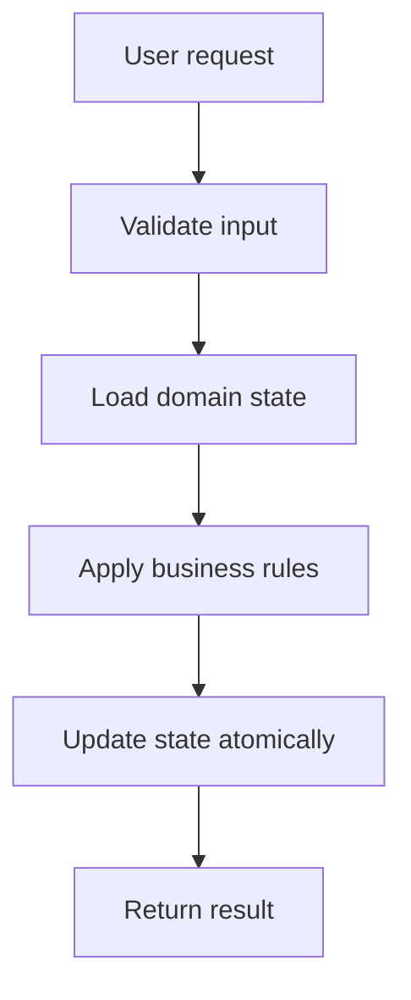
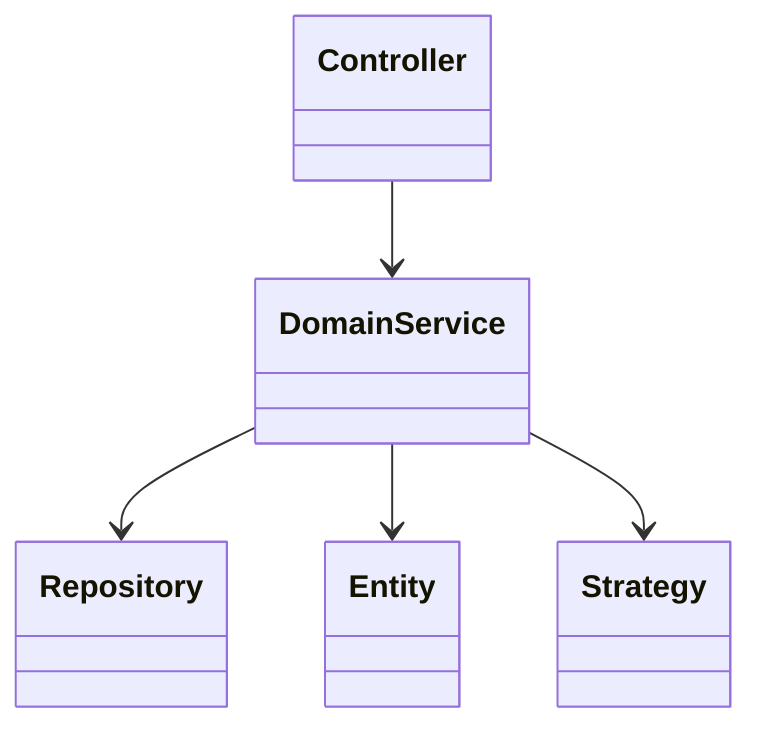
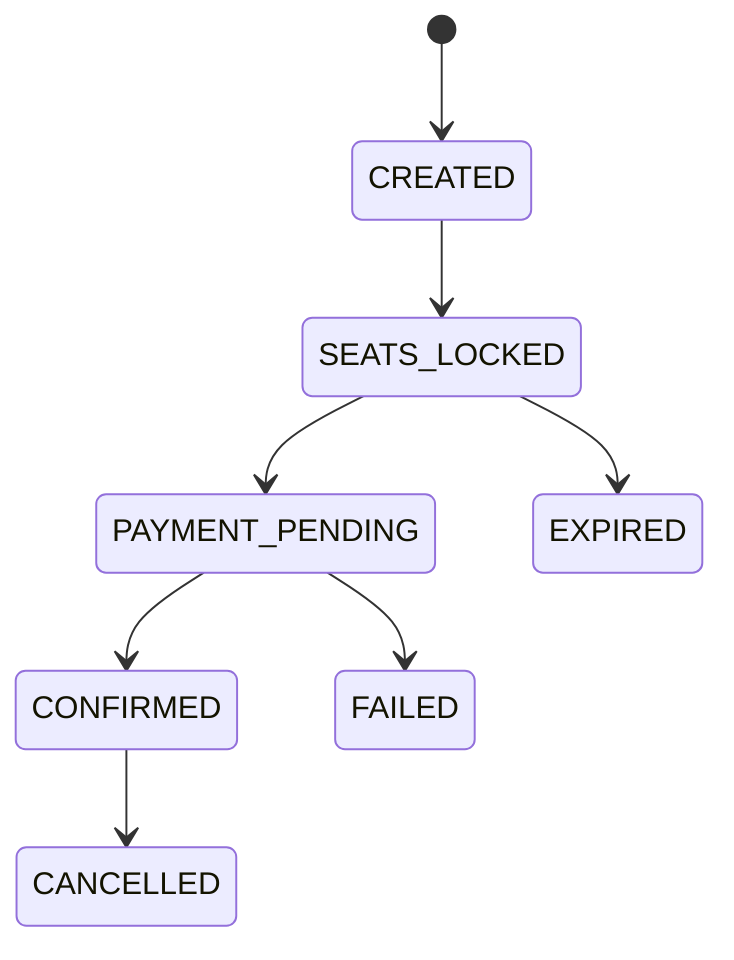

# Bookmyshow Low Level Design

## Problem Statement

Design a movie ticket booking system with cities, movies, theatres, shows, seats, seat locking, booking, payment, timeout, and cancellation.

## How To Start In Interview

Say:

"I will first clarify scope, then identify entities and workflows. After that I will discuss class design, patterns, concurrency, and edge cases."

## Functional Requirements

- Support the main user workflow end to end.
- Validate invalid operations.
- Keep domain state consistent.
- Return meaningful success/failure results.
- Allow future extension without rewriting the core model.

## Non-Functional Requirements

- Correctness over cleverness.
- Simple APIs.
- Thread safety for shared mutable resources.
- Clear separation between models, services, repositories, and strategies.
- Testable code.

## Core Entities

- `City`
- `Movie`
- `Theatre`
- `Screen`
- `Show`
- `Seat`
- `SeatLock`
- `Booking`
- `Payment`

## Core Services

- `MovieSearchService`
- `SeatLockService`
- `BookingService`
- `PaymentService`
- `NotificationService`

## High-Level Workflow



## Class Relationship Sketch



## Suggested Patterns

- Strategy for pricing
- State for booking lifecycle
- Observer for notifications
- Repository for storage

## Detailed Design Steps

1. Write down actors and use cases.
2. Model entities that have identity.
3. Model value objects for immutable concepts.
4. Put workflow orchestration inside services.
5. Put variable rules behind strategies.
6. Keep repositories as storage abstractions.
7. Make state transitions explicit.
8. Add concurrency protection around shared resources.
9. Write demo flows or unit tests.

## Concurrency Discussion

The shared resource is a seat for a show. Lock seats atomically with expiry. Payment success confirms booking; payment timeout releases locks. In production use optimistic locking or a unique constraint on confirmed show-seat bookings.

## Edge Cases

- Invalid ID or missing object.
- Duplicate request.
- Expired lock or stale state.
- Payment failure or external service failure.
- Concurrent modification.
- Cancellation after partial success.
- Retry after timeout.

## API Sketch

```java
class BookmyshowService {
    // validate request
    // load current state
    // apply domain rules
    // persist or update state
    // return response
}
```

## Interview Deep-Dive Points

- Explain why each class exists.
- Mention which rules are likely to change.
- Use Strategy for changeable policies.
- Use State when lifecycle behavior changes.
- Use Factory when object creation depends on type.
- Keep concurrency discussion concrete.

## What To Say If Asked For Production Scale

"For production, I would move in-memory repositories to durable storage, use transactions or optimistic locking for consistency, add idempotency keys for retries, and expose APIs through controllers. For distributed deployments, I would avoid local-only locks and rely on database constraints, distributed locks, or message-driven workflows depending on the exact consistency requirement."

## Domain-Specific Deep Dive

### Seat Locking Model

Seat booking is not just `seat.status = BOOKED`.

A better lifecycle:

```text
AVAILABLE -> LOCKED -> CONFIRMED
AVAILABLE -> LOCKED -> RELEASED -> AVAILABLE
```

`LOCKED` is temporary. It exists so the user can complete payment without someone else taking the same seat.

### Booking State Machine



### Important Classes

```java
class Show {
    String id;
    Movie movie;
    Screen screen;
    LocalDateTime startTime;
}

class SeatLock {
    String showId;
    String seatId;
    String userId;
    Instant expiresAt;
}

class Booking {
    String id;
    String userId;
    String showId;
    List<String> seatIds;
    BookingStatus status;
}
```

### Correctness Rule

For a given `(showId, seatId)`, only one active lock or confirmed booking can exist.

### Production Storage Idea

Use a unique constraint:

```text
unique(show_id, seat_id, status in ACTIVE_LOCK_OR_CONFIRMED)
```

Or use transaction/optimistic locking around seat rows.
