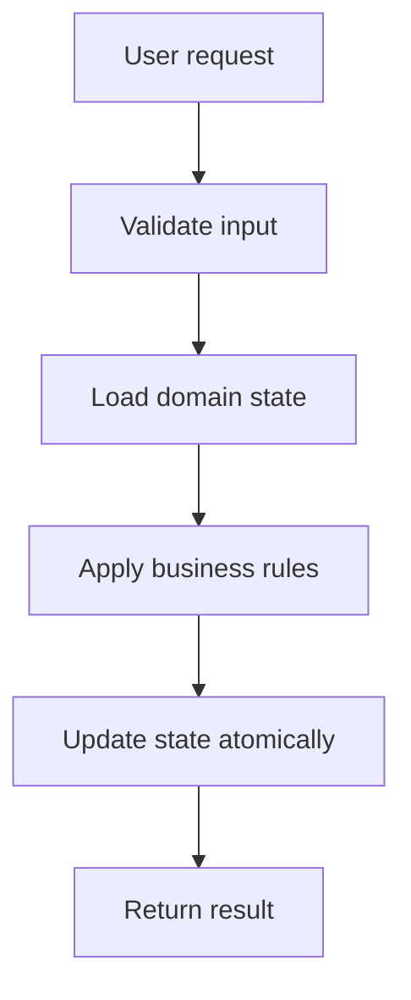
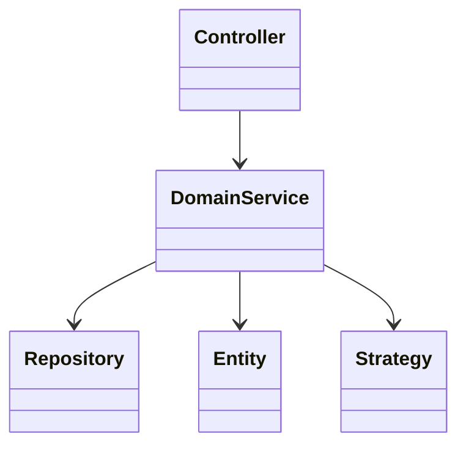

# Splitwise Low Level Design

## Problem Statement

Design an expense-sharing app with users, groups, expenses, exact/equal/percentage splits, balances, and settlement.

## How To Start In Interview

Say:

"I will first clarify scope, then identify entities and workflows. After that I will discuss class design, patterns, concurrency, and edge cases."

## Functional Requirements

- Support the main user workflow end to end.
- Validate invalid operations.
- Keep domain state consistent.
- Return meaningful success/failure results.
- Allow future extension without rewriting the core model.

## Non-Functional Requirements

- Correctness over cleverness.
- Simple APIs.
- Thread safety for shared mutable resources.
- Clear separation between models, services, repositories, and strategies.
- Testable code.

## Core Entities

- `User`
- `Group`
- `Expense`
- `Split`
- `BalanceSheet`
- `Settlement`

## Core Services

- `ExpenseService`
- `SplitStrategy`
- `BalanceService`
- `SettlementService`

## High-Level Workflow



## Class Relationship Sketch



## Suggested Patterns

- Strategy for split calculation
- Command for expense operations
- Repository for user/group storage

## Detailed Design Steps

1. Write down actors and use cases.
2. Model entities that have identity.
3. Model value objects for immutable concepts.
4. Put workflow orchestration inside services.
5. Put variable rules behind strategies.
6. Keep repositories as storage abstractions.
7. Make state transitions explicit.
8. Add concurrency protection around shared resources.
9. Write demo flows or unit tests.

## Concurrency Discussion

Concurrent expenses in the same group can update balances. Balance updates should be transactional or guarded by group-level locking.

## Edge Cases

- Invalid ID or missing object.
- Duplicate request.
- Expired lock or stale state.
- Payment failure or external service failure.
- Concurrent modification.
- Cancellation after partial success.
- Retry after timeout.

## API Sketch

```java
class SplitwiseService {
    // validate request
    // load current state
    // apply domain rules
    // persist or update state
    // return response
}
```

## Interview Deep-Dive Points

- Explain why each class exists.
- Mention which rules are likely to change.
- Use Strategy for changeable policies.
- Use State when lifecycle behavior changes.
- Use Factory when object creation depends on type.
- Keep concurrency discussion concrete.

## What To Say If Asked For Production Scale

"For production, I would move in-memory repositories to durable storage, use transactions or optimistic locking for consistency, add idempotency keys for retries, and expose APIs through controllers. For distributed deployments, I would avoid local-only locks and rely on database constraints, distributed locks, or message-driven workflows depending on the exact consistency requirement."

## Domain-Specific Deep Dive

### Balance Model

Instead of storing every pair forever, maintain net balances:

```text
paidBy balance += amount
each participant balance -= share
```

Positive balance means user should receive money. Negative balance means user owes money.

### Split Strategies

- Equal split
- Exact split
- Percentage split

Use Strategy because split calculation varies.

### Settlement Simplification

Use two lists:

- debtors
- creditors

Match largest debtor with largest creditor until balances become zero.
