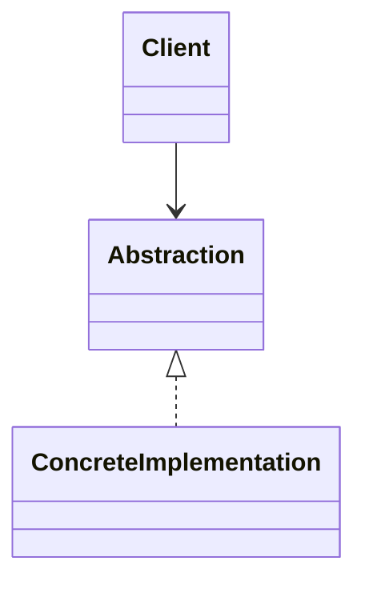

# Facade Pattern

Category: Structural

## Intent

Provide a simple interface over a complex subsystem.

## Why This Pattern Exists

Client code must coordinate many subsystem classes directly.

In small programs you may not need Facade. In LLD interviews, the pattern becomes useful when requirements start changing and direct code would become brittle.

## Real-World Analogy

Checkout facade calling inventory, payment, invoice, notification.

## Structure

Main participants:

- Facade
- Subsystem classes
- Client



The diagram is intentionally generic. Open the Java implementation to see concrete class names for this pattern.

## Step-By-Step Implementation

1. Identify the part of the code that changes.
2. Put stable behavior behind an interface or small abstraction.
3. Move concrete behavior into focused classes.
4. Make client code depend on the abstraction.
5. Add a demo flow proving the pattern works.

## Java Implementation

See:

`src/main/java/com/anish/lld/patterns/structural/FacadeDemo.java`

## When To Use

Use this pattern when:

- The stated problem appears in your design.
- New requirements are likely to change this area.
- The abstraction makes client code simpler.
- The number of extra classes is justified.

## When Not To Use

Avoid this pattern when:

- A direct implementation is clearer.
- There is only one implementation and no sign of variation.
- The pattern hides simple business logic.
- You are adding it only because you memorized it.

## Advantages

- Improves separation of concerns.
- Makes the variable part easier to extend.
- Helps satisfy Open Closed Principle when used correctly.
- Gives a common vocabulary in design discussions.

## Tradeoffs

Facade should not become a god class with business logic from everywhere.

## Interview Explanation

"Facade is useful when provide a simple interface over a complex subsystem. In my design I would use it when the changing part should be isolated from the stable client code. The tradeoff is that it introduces extra classes, so I would use it only when extension or decoupling is actually needed."

## Common Interview Trap

The trap is naming the pattern without explaining the design pressure. Always explain the problem first, then the pattern.

## Related Patterns

- Factory and Abstract Factory are often compared in creational designs.
- Strategy and State both use polymorphism, but Strategy changes algorithm and State changes behavior based on lifecycle.
- Decorator and Proxy both wrap objects, but Decorator adds behavior while Proxy controls access.


## Deep Implementation Notes

### Concrete LLD Scenario

In the demo implementation, `CheckoutFacade` is the center of the pattern.

Design pressure:

Client wants one checkout call instead of coordinating inventory/payment/invoice.

This is exactly how patterns appear in real LLD rounds: not as theory, but as pressure caused by changing requirements.

### Before Applying The Pattern

The code usually looks like this:

```java
if (type.equals("A")) {
    // create or execute behavior A
} else if (type.equals("B")) {
    // create or execute behavior B
} else if (type.equals("C")) {
    // create or execute behavior C
}
```

Problems:

- The caller knows too much.
- Every new variation modifies old code.
- Testing each variation becomes harder.
- The class violates Single Responsibility and often Open Closed Principle.

### After Applying The Pattern

The changing behavior moves behind a focused abstraction. The client talks to the abstraction and does not need to know the concrete implementation details.

Result:

- New behavior can be added with less modification.
- Unit tests can target each implementation separately.
- The design has clearer names for concepts.
- The code becomes easier to discuss in interviews.

### Implementation Walkthrough

1. Find the changing part of the requirement.
2. Name that variation as an interface or base abstraction.
3. Create one class per concrete variation.
4. Keep the client dependent on the abstraction.
5. Add a small demo proving the design.
6. Explain why the added classes are worth it.

### Code Reading Guide

Open the Java file for this pattern and read it in this order:

1. Read the interface or abstraction first.
2. Read concrete implementations next.
3. Read the context/client class last.
4. Check how `run()` wires everything together.

### Extension Exercise

Add notification after checkout without changing the client.

Try to implement this without changing existing client flow. That is the real test of whether the pattern is designed well.

### Production-Level Considerations

- Add validation for bad input.
- Keep error handling close to the boundary where failures happen.
- Prefer dependency injection in production code instead of manually creating every object.
- Keep interfaces small.
- Do not hide business rules behind vague class names like `Manager` or `Helper`.

### How To Explain In An Interview

"I would use Facade here because the requirement has a clear variation point. By moving that variation behind an abstraction, the stable workflow remains unchanged and new behavior can be added in a focused class. The tradeoff is extra classes, so I would use it only when this part is expected to grow or change."

### One-Line Revision

Facade = solve the changing-design pressure cleanly, without forcing client code to know every concrete detail.

