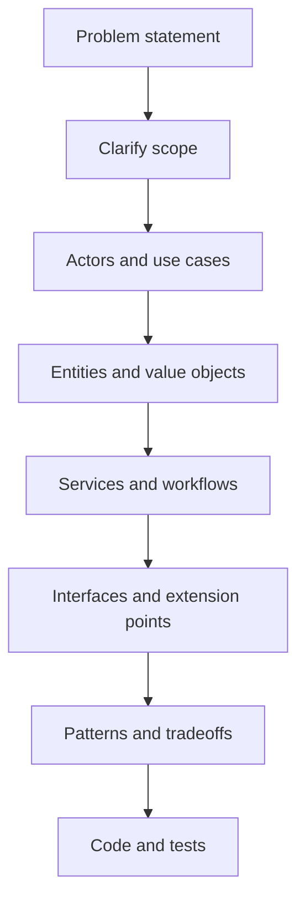

# How To Think In LLD

LLD is not about memorizing diagrams. It is about converting behavior into clean code boundaries.

## The Core Idea

Whenever you see a problem statement, ask:

- What objects exist in the domain?
- What responsibilities does each object own?
- Which rules change frequently?
- Which workflows coordinate multiple objects?
- Which objects should not know about each other?
- Where can concurrency break correctness?

## Requirement To Code Pipeline

## Entity vs Value Object vs Service

### Entity

An entity has identity and lifecycle.

Examples:

- User
- Order
- Booking
- Vehicle
- Elevator

Two entities can have the same fields but still be different because their identity differs.

### Value Object

A value object is defined only by its values.

Examples:

- Money
- Address
- DateRange
- SeatNumber
- GeoLocation

Value objects should usually be immutable.

### Service

A service coordinates business behavior that does not naturally belong to one entity.

Examples:

- BookingService
- PaymentService
- SeatLockService
- ElevatorDispatcher

Bad sign:

If a service becomes a huge class with all logic, you have an anemic domain model.

## How To Find Classes

Start with nouns, then clean them up.

Requirement:

"A user can book seats for a movie show and pay online."

Raw nouns:

- user
- seats
- movie
- show
- payment

Possible classes:

- User
- Seat
- Movie
- Show
- Booking
- Payment
- BookingService
- PaymentGateway

## How To Find Methods

Start with verbs.

Requirement verbs:

- search movie
- select show
- lock seats
- create booking
- make payment
- confirm booking
- release seats

Possible methods:

- `MovieSearchService.search(criteria)`
- `SeatLockService.lockSeats(showId, seatIds, userId)`
- `BookingService.createBooking(command)`
- `PaymentService.pay(paymentRequest)`
- `Booking.confirm(paymentId)`
- `SeatLockService.releaseExpiredLocks()`

## Where Design Patterns Fit

Patterns are not the starting point. Requirements are the starting point.

Use a pattern when you see a design pressure:

| Design Pressure | Useful Pattern |
|---|---|
| Object creation varies | Factory Method, Abstract Factory |
| Object construction has many optional fields | Builder |
| Behavior changes at runtime | Strategy |
| State changes behavior | State |
| Need notifications | Observer |
| Need undo/redo | Command, Memento |
| Need access control/caching/lazy loading | Proxy |
| Need wrapper behavior | Decorator |
| Need simple API over complex subsystem | Facade |
| Need validation pipeline | Chain of Responsibility |

## Interview Method

When asked to design something, say:

"I will first clarify requirements and scope, then identify core entities and workflows. After that I will define class responsibilities, relationships, and extension points. Finally I will discuss concurrency, edge cases, and patterns."

This sounds structured and prevents jumping randomly into classes.
