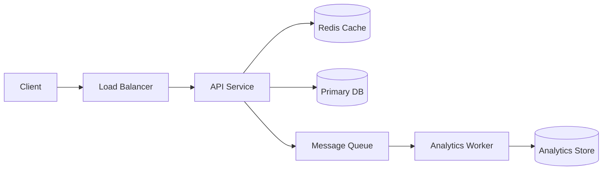

# How To Approach HLD Interviews

Most system design interviews are not testing one correct answer. They test how you reason.

## Step 1: Clarify Requirements

Ask:

- Who are the users?
- What are the core features?
- What is explicitly out of scope?
- What is the expected scale?
- Is low latency more important than strong consistency?
- Is this read-heavy or write-heavy?
- Are there compliance/security constraints?

## Step 2: Define Functional Requirements

Example for URL shortener:

- Create short URL.
- Redirect short URL to original URL.
- Support custom alias.
- Support expiry.
- Track analytics.

## Step 3: Define Non-Functional Requirements

Examples:

- Low redirect latency.
- High availability.
- Durable mapping storage.
- Eventual consistency acceptable for analytics.
- Avoid collisions.

## Step 4: Back-Of-The-Envelope Estimation

Estimate:

- Daily active users.
- Requests per second.
- Read/write ratio.
- Storage per day.
- Bandwidth.
- Cache size.

Simple formula:

```text
QPS = daily_requests / 86400
Peak QPS = average QPS * 3 to 10
Storage = records_per_day * size_per_record * retention_days
```

## Step 5: API Design

Keep APIs minimal:

```http
POST /v1/urls
GET /{shortCode}
GET /v1/urls/{id}/analytics
```

Discuss idempotency for write APIs.

## Step 6: Data Model

Define tables/collections:

```text
UrlMapping(id, short_code, long_url, user_id, expires_at, created_at)
ClickEvent(short_code, timestamp, referrer, country, device)
```

## Step 7: High-Level Architecture



## Step 8: Deep Dives

Choose 2-3 important areas:

- Cache strategy
- DB sharding
- Consistency
- Rate limiting
- Queue processing
- Failure handling

## Step 9: Bottlenecks And Tradeoffs

Every design has tradeoffs.

Good sentence:

"I am choosing eventual consistency for analytics because redirect latency is more important, and click analytics can lag by a few seconds."

## Step 10: Final Summary

Close with:

- Main architecture
- Key decisions
- Failure handling
- Scalability path
