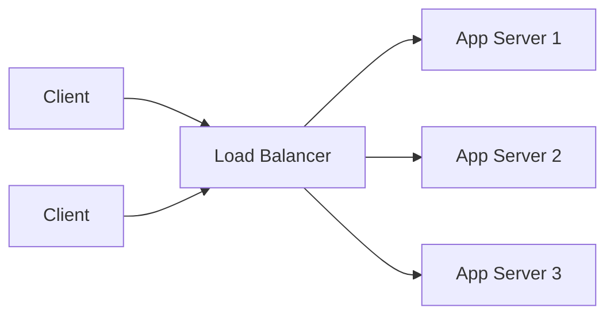

# Scalability And Load Balancing

Scalability means the system can handle increased load by adding resources.

## Vertical Scaling

Increase CPU/RAM/disk on one machine.

Pros:

- Simple.
- No distributed complexity.

Cons:

- Hardware limit.
- Single point of failure.
- Expensive at high scale.

## Horizontal Scaling

Add more machines.

Pros:

- Better fault tolerance.
- Scales beyond one machine.

Cons:

- Requires load balancing.
- Requires stateless services or session management.
- Distributed systems complexity.

## Stateless Services

Application servers should avoid storing user/session state locally.

Better:

- Store session in Redis.
- Use JWT carefully.
- Store durable data in DB.

## Load Balancer

Distributes traffic across servers.

Algorithms:

- Round robin
- Weighted round robin
- Least connections
- IP hash
- Random

## L4 vs L7 Load Balancing

| Type | Layer | Routing Based On |
|---|---|---|
| L4 | Transport | IP, port, TCP/UDP |
| L7 | Application | HTTP path, headers, cookies |

## Reverse Proxy

A reverse proxy sits in front of backend services.

Examples:

- Nginx
- Envoy
- HAProxy

Responsibilities:

- Routing
- TLS termination
- Compression
- Caching
- Rate limiting

## Common Bottlenecks

- Database writes
- Hot partition
- Cache stampede
- Queue backlog
- Slow external dependency
- Lock contention
