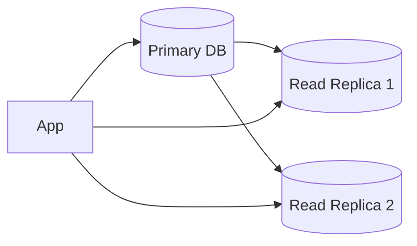

# Database Design

Choosing storage is one of the most important HLD decisions.

## SQL Databases

Use SQL when:

- Strong consistency is important.
- Relationships matter.
- Transactions are needed.
- Schema is structured.

Examples:

- Payments
- Orders
- Banking ledger
- Inventory

## NoSQL Databases

Use NoSQL when:

- Scale is very high.
- Data model is flexible.
- Access patterns are known.
- Eventual consistency is acceptable.

Types:

- Key-value store
- Document store
- Wide-column store
- Graph database

## Indexing

Indexes speed reads but slow writes.

Example:

```sql
CREATE INDEX idx_user_created_at ON orders(user_id, created_at);
```

Tradeoff:

- Faster lookup.
- Extra storage.
- Write overhead.

## Replication

Replication copies data to multiple nodes.



Use replicas for read scaling.

Replication lag means reads may be stale.

## Sharding

Sharding splits data across multiple databases.

Shard key examples:

- user_id
- tenant_id
- region
- hash(id)

Good shard key:

- High cardinality.
- Even distribution.
- Query-friendly.
- Avoids hot partitions.

Bad shard key:

- country for global app, because some countries may be huge.
- timestamp for write-heavy app, because latest shard becomes hot.

## Denormalization

Duplicate data to make reads faster.

Example:

Store `user_name` in `Post` so feed rendering does not join user table every time.

Tradeoff:

- Faster reads.
- More complex writes.
- Risk of stale data.

## Transactions

Use transactions when multiple updates must succeed or fail together.

Example:

- deduct wallet balance
- create payment record
- update order status

## Data Modeling Rule

Design tables based on query patterns, not only entity relationships.
