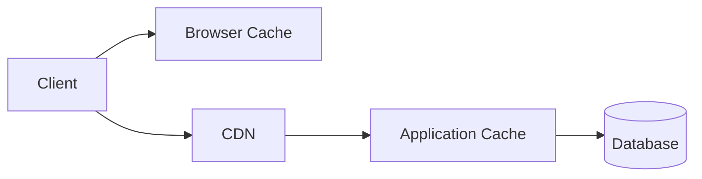
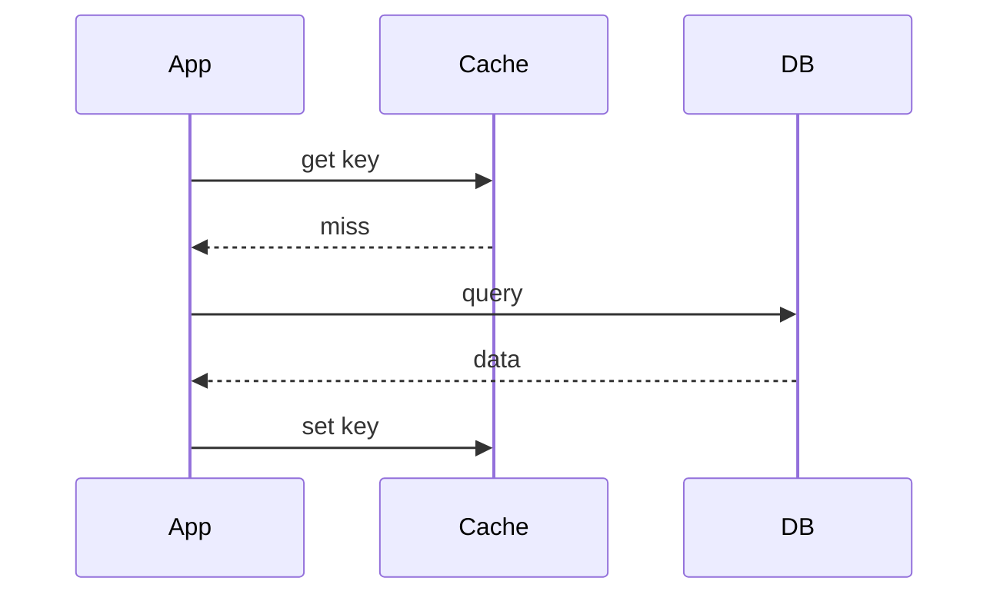

# Caching

Caching stores frequently accessed data closer to the user or application.

## Why Cache?

- Reduce database load.
- Improve latency.
- Absorb traffic spikes.
- Reduce cost.

## Cache Locations

## Cache-Aside Pattern

Most common pattern.

Read flow:

1. App checks cache.
2. If hit, return data.
3. If miss, read DB.
4. Store result in cache.
5. Return data.

## Write-Through

Write goes to cache and DB together.

Pros:

- Cache stays fresh.

Cons:

- Higher write latency.

## Write-Back

Write goes to cache first and DB later.

Pros:

- Fast writes.

Cons:

- Data loss risk if cache fails.

## TTL

TTL means time-to-live.

Short TTL:

- Fresher data.
- More DB load.

Long TTL:

- Better cache hit rate.
- More stale data.

## Cache Problems

### Cache Penetration

Repeated requests for missing keys hit DB.

Fix:

- Cache null values.
- Bloom filter.

### Cache Breakdown

Hot key expires and many requests hit DB.

Fix:

- Mutex lock.
- Refresh ahead.
- Staggered TTL.

### Cache Avalanche

Many keys expire together.

Fix:

- Randomized TTL.
- Multi-level cache.

## Redis Use Cases

- Sessions
- Rate limiting
- Leaderboards
- Distributed locks
- Pub/Sub
- Hot object cache
