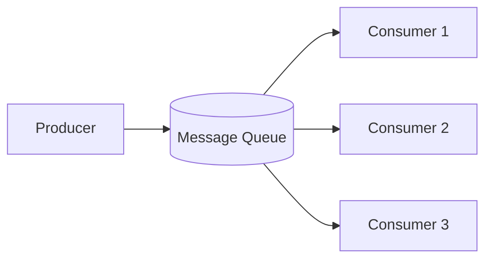

# Message Queues And Event-Driven Design

Message queues decouple producers from consumers.

## Why Use Queues?

- Smooth traffic spikes.
- Retry failed work.
- Decouple services.
- Process slow tasks asynchronously.
- Improve user-facing latency.

## Basic Architecture



## Examples

- Send email after signup.
- Process video upload.
- Generate invoice.
- Update analytics.
- Fan out notifications.

## Queue vs Pub/Sub

| Model | Meaning |
|---|---|
| Queue | One message consumed by one worker |
| Pub/Sub | One event delivered to many subscribers |

## Delivery Semantics

### At Most Once

Message may be lost but never duplicated.

### At Least Once

Message is not lost, but duplicates may happen.

Requires idempotent consumers.

### Exactly Once

Hard and expensive. Often simulated with idempotency and transactions.

## Idempotency

Idempotent operation can be safely retried.

Example:

Use `idempotency_key` for payment:

```text
payment_request_id = unique
if already processed, return previous result
else process payment
```

## Dead Letter Queue

Messages that repeatedly fail go to DLQ for inspection.

## Backpressure

If consumers cannot keep up, queue grows.

Solutions:

- Add consumers.
- Rate limit producers.
- Drop non-critical events.
- Prioritize queues.
- Scale processing.
