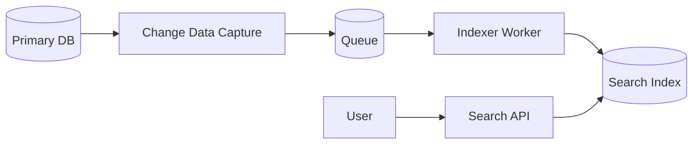

# Storage, Search, And Indexing

Different data needs different storage.

## Object Storage

Use object storage for large binary files:

- Images
- Videos
- PDFs
- Backups

Examples:

- S3
- GCS
- Azure Blob

## CDN

CDN stores static content near users.


Use for:

- Images
- Videos
- JS/CSS
- Public downloads

## Search Index

Use search engines for full-text search:

- Elasticsearch
- OpenSearch
- Solr

Primary DB is not ideal for fuzzy search, ranking, typo tolerance, and full-text relevance.

## Search Pipeline



## Inverted Index

Search engines use inverted indexes.

Example:

```text
word "phone" -> doc1, doc7, doc9
word "charger" -> doc2, doc7
```

## Blob Metadata

Store file metadata in DB:

```text
File(id, owner_id, object_key, content_type, size, created_at)
```

Store actual file in object storage.
