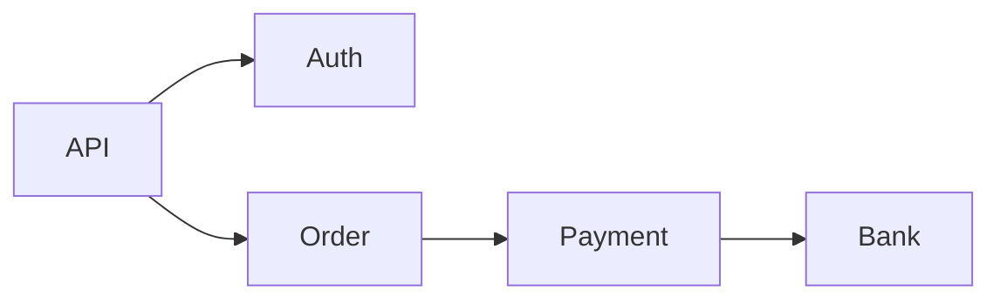

# Observability, Reliability, And SRE

Designing a system also means designing how to operate it.

## Metrics

Numeric time-series data.

Examples:

- request count
- latency p95/p99
- error rate
- CPU/memory
- queue depth
- cache hit ratio

## Logs

Discrete events useful for debugging.

Good log:

```text
order_id=123 payment_id=abc status=FAILED reason=TIMEOUT
```

Bad log:

```text
something went wrong
```

## Traces

Trace follows one request across services.



## SLI, SLO, SLA

SLI:

- Measured metric.

SLO:

- Internal target.

SLA:

- Contractual promise.

Example:

- SLI: successful requests / total requests
- SLO: 99.9% availability
- SLA: 99.5% availability with penalty

## Reliability Patterns

### Timeout

Never wait forever for dependencies.

### Retry

Retry transient failures.

Use exponential backoff.

### Circuit Breaker

Stop calling a failing dependency temporarily.

### Bulkhead

Isolate failures by resource pool.

### Graceful Degradation

Return partial functionality instead of total failure.

Example:

If recommendation service fails, show popular items.
