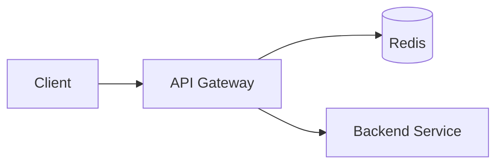

# Security, Rate Limiting, And Abuse Prevention

Security must be part of HLD, not an afterthought.

## Authentication vs Authorization

Authentication:

- Who are you?

Authorization:

- What are you allowed to do?

## Common Auth Approaches

- Session cookie
- JWT
- OAuth2
- API keys
- mTLS for service-to-service

## Rate Limiting

Controls request volume.

Use cases:

- Prevent abuse.
- Protect expensive APIs.
- Enforce plans/quotas.

## Algorithms

### Token Bucket

Tokens refill at a fixed rate. Request consumes token.

Allows bursts.

### Leaky Bucket

Requests are processed at constant rate.

Smooths bursts.

### Fixed Window

Count requests per fixed interval.

Simple but boundary burst problem.

### Sliding Window

More accurate than fixed window.

## Rate Limiter Architecture

## Abuse Prevention

- CAPTCHA
- device fingerprinting
- IP reputation
- velocity checks
- anomaly detection
- email/phone verification
- fraud scoring

## Data Protection

- Encrypt in transit.
- Encrypt at rest.
- Hash passwords with bcrypt/argon2.
- Do not store secrets in logs.
- Use least privilege.
