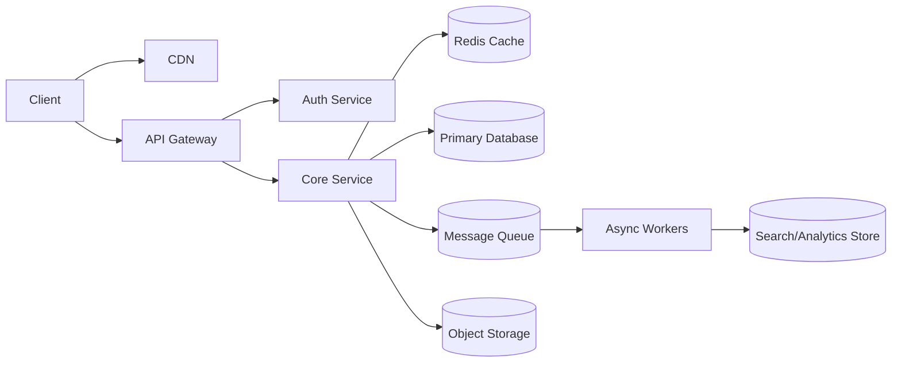

# Design Ride Sharing System

## Problem

Design Ride Sharing System at high level.

## Functional Requirements

- Match rider and driver.
- Track location.
- Estimate fare.
- Complete trip/payment.

## Non-Functional Requirements

- High availability for user-facing reads.
- Low latency for core user actions.
- Horizontal scalability.
- Fault tolerance.
- Observability.
- Secure APIs.

## Scale Assumptions

These numbers are interview assumptions. Always state them clearly.

- Daily active users: 10M to 100M depending on product.
- Read/write ratio: usually read-heavy unless noted.
- Peak QPS: 3x to 10x average QPS.
- Data retention: define by product.

## API Sketch

```http
POST /v1/rides
GET /v1/rides/{id}
GET /v1/rides/{id}/status
```

## Data Model

```text
User(id, name, email, created_at)
Entity(id, owner_id, status, created_at, updated_at)
Event(id, entity_id, type, payload, created_at)
```

## High-Level Architecture



## Request Flow

1. Client sends request to API Gateway.
2. Gateway authenticates and rate-limits request.
3. Core service validates input.
4. Core service reads/writes cache and database.
5. Non-critical work goes to queue.
6. Workers process async tasks.
7. Metrics/logs/traces are emitted.

## Deep Dive Areas

### Data Partitioning

Choose partition key based on access pattern. Common choices:

- `user_id`
- `tenant_id`
- `region`
- hash of entity id

Avoid shard keys that create hot partitions.

### Caching

Cache read-heavy objects with TTL. Use cache-aside unless there is a strong reason for write-through.

### Consistency

Decide which flows need strong consistency and which can be eventual.

### Failure Handling

- Timeouts for remote calls.
- Retries with exponential backoff.
- Idempotency keys for writes.
- Dead letter queue for failed async events.
- Circuit breaker for unstable dependencies.

## Bottlenecks

- Hot keys.
- Database write throughput.
- Queue backlog.
- Search indexing lag.
- External dependency latency.

## Tradeoffs

- Strong consistency improves correctness but may reduce availability.
- Caching improves latency but introduces staleness.
- Async processing improves responsiveness but introduces eventual consistency.
- Sharding improves scale but complicates queries.

## Interview Summary

"The design uses stateless services behind a gateway/load balancer, cache for hot reads, durable database for source of truth, queue for asynchronous processing, and observability across the system. The key tradeoff is balancing consistency, latency, and operational complexity."
